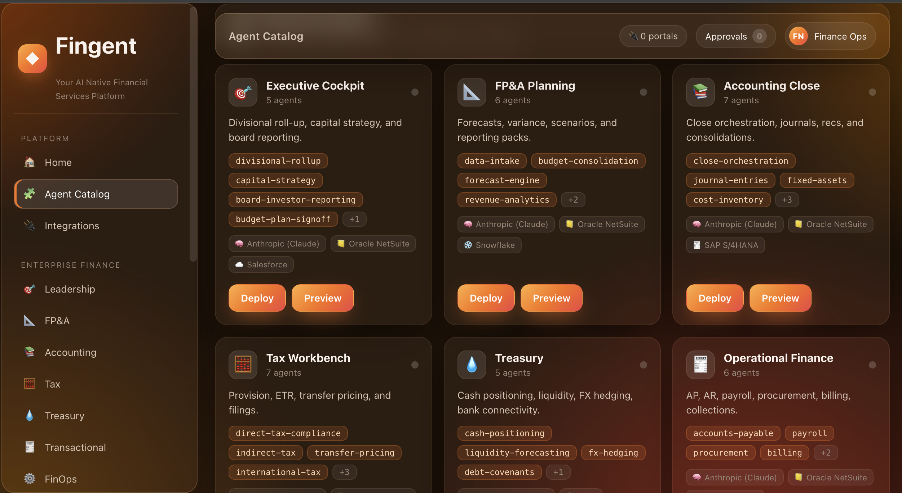
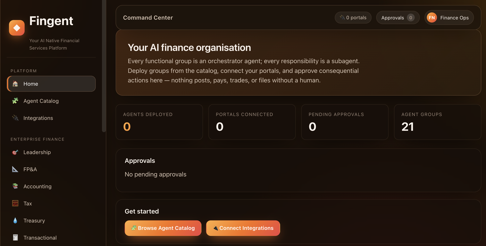
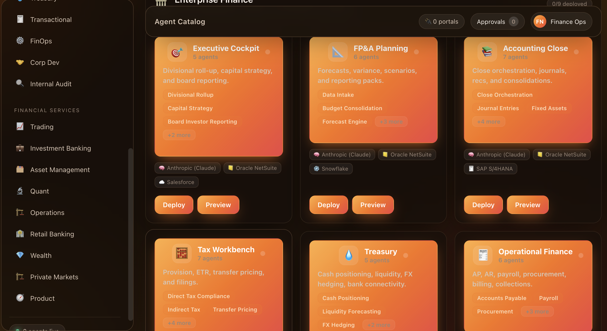

<div align="center">

# ◆ Fingent

### Your AI-native financial services platform

**Replace the org chart with an *agent chart*.** Every functional group in a finance organisation becomes an orchestrator agent; every responsibility becomes a subagent — with a human in the loop on every consequential action.




</div>

---

## What is Fingent?

Fingent is a platform where the work of an entire finance organisation — both the **in-house finance function** and the **financial-services lines of business** — is executed by orchestrated AI agents.

It is **not a chatbot**. It is a system of autonomous-but-governed finance workers, exposed through dashboards, approval queues, and immutable audit trails. Each functional group (FP&A, Treasury, Trading, Compliance…) is an **orchestrator agent** that owns a plan and dispatches **subagents** — one per responsibility — running sequentially, in parallel, or in hybrid flows depending on data dependencies.

Crucially, **nothing posts to a ledger, moves cash, executes a trade, binds risk, lends, or files externally without a human approving it.** Default-deny guardrails intercept every consequential action and route it to an approval queue.

> **21 agent groups · 130+ subagents · 14 connectable portals · 2 organisations**

---

## What it can do

🏛️ **Run the in-house finance function** — close the books, build driver-based forecasts, explain variances, compute the tax provision, position cash, hedge FX, run AP/AR/payroll, evaluate M&A deals, and test SOX controls.

📈 **Run financial-services lines of business** — price and quote trades, structure products, underwrite loans and PE/VC/credit deals, build pitchbooks, manage portfolios, screen AML/KYC and sanctions, and run actuarial and claims workflows.

🤖 **Orchestrate real work, not just chat** — a deterministic runner fans subagents out across `SEQUENTIAL` / `PARALLEL` / `HYBRID` step graphs and streams per-subagent progress live to the UI over SSE.

🛡️ **Keep humans in control** — every consequential tool call (post a journal, fund a loan, file a return, launch a deal, commit capital) is held in a **default-deny approval queue** with full evidence. Mandatory risk/compliance gates block trades and binds before they ever reach the queue.

🧾 **Audit everything** — every decision, tool call, input, and approval is logged immutably.

🔌 **Plug into your stack** — a typed connector layer abstracts ERP/GL, banking, market data, CRM, document stores, and screening behind one consistent `Tool` interface.

<div align="center">



*The Agent Catalog — click any group to see what it can do and how to use it, then deploy in one click.*

</div>

---

## The agent chart

Two organisations, 21 group-agents. Click a card in the catalog to read its plain-English capabilities, meet its subagents (human-approval **gates** are flagged), see which portals it needs, and deploy.

### 🏛️ Enterprise Finance — *close, plan, fund, comply*

| Group | What it does |
|---|---|
| **Executive Cockpit** | Divisional roll-up, capital strategy, board reporting, budget sign-off |
| **FP&A Planning** | Driver-based forecasts, variance commentary, scenarios, reporting packs |
| **Accounting Close** | Close orchestration, journals, reconciliations, consolidations |
| **Tax Workbench** | Provision & ETR, direct/indirect/international filings, transfer pricing |
| **Treasury** | Cash positioning, liquidity forecasting, FX hedging, bank connectivity |
| **Operational Finance** | AP, AR, payroll, procurement, billing, collections |
| **Finance Systems & Ops** | Data pipelines, dashboards, ERP & master-data admin, process improvement |
| **Deal Room (Corp Dev)** | Pipeline, EV + accretion/dilution models, diligence, CIM assembly |
| **Internal Audit** | Risk-based planning, SOX testing, findings, remediation to closure |

### 📈 Financial Services — *markets, lending, advisory*

| Group | What it does |
|---|---|
| **Sales & Trading** | Pricing, quant signals, structuring, pre-trade risk gate, execution |
| **Investment Banking** | Coverage, EV models, pitchbooks, compliance-gated M&A / ECM / DCM |
| **Asset Management** | Macro, allocation, portfolio construction, mandate-risk gate, execution |
| **Quant, Data & Tech** | Pricing & risk models, research, validation, promotion to production |
| **Operations** | Trade support, settlements, custody, fund accounting, collateral |
| **Retail & Commercial Banking** | Personal/commercial banking, origination, credit, underwriting, funding |
| **Wealth & Private Banking** | KYC onboarding, planning, suitability gate, discretionary PM |
| **Private Markets** | Origination, PE/VC & credit & real-asset underwriting, IC, stewardship |
| **Product, Strategy & Client** | Product, pricing, regulatory filing, launch, distribution, client services |
| **Risk Management** | Market, credit, liquidity, operational & enterprise risk + model validation |
| **Compliance & Financial Crime** | AML/KYC, sanctions, fraud, monitoring, regulatory affairs |
| **Insurance & Actuarial** | Actuarial reserving, cat modelling, underwriting, claims, reinsurance |

---

## How it works

```
React UI ──REST/SSE──► FastAPI ──► Orchestrator Agent (per group)
                          │              │
                          │              ├─► Subagent task ─┐
                          │              ├─► Subagent task ─┼─► Tool / Connector layer ─► ERP / Banks / Market data
                          │              └─► Subagent task ─┘            │
                          ▼                                              ▼
                  Job queue (SSE progress)              Guardrail / Approval engine (default-deny)
                          │                                              │
                          └──────────────► Immutable audit log ◄─────────┘
                                                   │
                                       Human-in-the-loop approval queue
```

- **Orchestrator agent** = a group. Owns a plan, dispatches subagents over a deterministic step graph.
- **Subagent** = one responsibility cluster. Stateless, cancellable, emits progress events.
- **Determinism where it matters** — *who runs when* is deterministic code; only the reasoning inside a subagent is model-driven (Claude Opus for reasoning/orchestration, Haiku for cheap high-volume tasks).
- **Guardrail engine** intercepts any consequential tool call and routes it to a human before execution.

---

## Quickstart

### Run the whole stack with Docker

```bash
git clone <this-repo> && cd Adv.rag
cp .env.example .env          # works as-is; fill in keys when you want them live
docker compose up --build
```

- Frontend → **http://localhost:8080**
- Backend API → **http://localhost:8000** (health: `/health`)

The app boots out of the box with in-memory fakes and a no-network Claude stub, so you can explore every dashboard, deploy flow, and approval queue immediately — no credentials required.

### Or run each side locally

<details>
<summary><b>Backend</b> (Python 3.12, <a href="https://github.com/astral-sh/uv">uv</a>)</summary>

```bash
cd backend
uv sync                                   # install
uv run uvicorn app.main:app --reload      # serve on :8000
make check                                # lint + typecheck + coverage (≥85%)
```
</details>

<details>
<summary><b>Frontend</b> (Node 20, npm)</summary>

```bash
cd frontend
npm install
npm run dev                              # vite dev server (proxies /api to :8000)
npm run lint && npm run typecheck && npm test   # quality gate
```
</details>

---

## Getting started: connect portals & deploy an agent

Fingent connects to the systems your org already runs. You supply credentials **in the product** — no code, no redeploys — and they are scoped per portal.

<div align="center">



</div>

**1. Connect your portals** → open **Integrations** in the sidebar. Each portal asks for exactly the credentials it needs:

| Portal | Category | What you provide |
|---|---|---|
| **Anthropic (Claude)** | Model provider | `ANTHROPIC_API_KEY` |
| Oracle NetSuite | ERP / GL | Account ID · API key |
| SAP S/4HANA | ERP / GL | Host URL · API key |
| QuickBooks | ERP / GL | API key |
| Plaid | Banking | Client ID · Secret |
| SWIFT gpi | Banking | BIC · API key |
| J.P. Morgan Access | Banking | API key |
| Bloomberg Terminal | Market data | API key |
| LSEG Refinitiv | Market data | API key |
| FactSet | Market data | API key |
| Salesforce | CRM | Instance URL · API key |
| SharePoint | Documents | Tenant · API key |
| Snowflake | Data warehouse | Account · API key |
| World-Check | Screening | API key |

**2. Deploy a group** → in the **Agent Catalog**, pick a group and hit **Deploy**. The one-click flow:
   - asks for any required portal keys it doesn't already have,
   - asks for the **human approver** (e.g. `cfo@firm.com`) who signs off this group's consequential actions,
   - records the deployment.

**3. Run work & approve** → open the group's dashboard, start a job (forecast, close, trade, underwrite…), and watch subagents stream progress live. Anything consequential lands in your **Approvals** queue — review the evidence, then approve or reject. Nothing posts, pays, trades, or files until you do.

> **Where keys live today.** Portal credentials entered in the UI are stored client-side as the configuration layer; the production build wires them to a backend provisioning endpoint. For the server-side Claude transport, set `ANTHROPIC_API_KEY` in `.env` (see status note below).

---

## Status

This repository is the **foundation**: the agent core, all 21 group-agents with their subagents, the job system, guardrails, audit log, the full React shell, and the deploy/integrations flow — all built test-first and green (635 backend + 146 frontend tests, ≥85% coverage both sides).

By default the app runs with **in-memory fakes and a stub Claude transport** so it is fully explorable with zero setup. Live datastores (Postgres, Redis, pgvector), the production Anthropic transport, and real external connectors are the target architecture described in [CLAUDE.md](CLAUDE.md) and land as the production context is wired — the `.env` keys and commented `docker-compose` services above are the seams for that.

---

## Tech stack

| Layer | Choice |
|---|---|
| Backend | FastAPI (async), Python 3.12 |
| Agent runtime | Custom deterministic orchestrator over the Claude API (Opus + Haiku routing, retries, token accounting) |
| Frontend | React + TypeScript + Vite |
| Streaming | Server-Sent Events (per-subagent progress) |
| Governance | Default-deny approval engine + immutable audit log |
| Data (target) | Postgres · Redis · pgvector/Qdrant |

---

## Project layout

```
backend/    FastAPI app, agent core, 21 group-agents, connectors, jobs, guardrails, audit
  app/agents/core/                 base Subagent/Orchestrator, runner, ClaudeGateway
  app/agents/enterprise/           9 enterprise-finance group-agents
  app/agents/financial_services/   12 financial-services group-agents
  app/agents/_template/            tested reference group-agent (copy to add a group)
frontend/   React + TS + Vite shell
  src/lib/catalog.ts               organisations, groups, agents, portals (drives the catalog)
  src/components/                  AgentCatalog, DeployModal, Integrations, ApprovalDrawer, JobTimeline
  src/pages/                       one dashboard per group-agent
```

---

## Building a group-agent

Copy `backend/app/agents/_template/` to `app/agents/<org>/<group>/`, rename `template` → your group, and follow strict TDD per [build.md](build.md). Honor the orchestration choice (sequential / parallel / hybrid) in the group spec and prove every consequential action is gated. Routers auto-discover — there is no shared registry to hand-edit.

## Documentation

- **[CLAUDE.md](CLAUDE.md)** — vision, architecture, phased build plan
- **[CONTRACTS.md](CONTRACTS.md)** — the frozen interfaces every group-agent imports
- **[build.md](build.md)** — multi-session TDD runbook
- **[roles.md](roles.md)** — the full finance role catalogue behind the agent chart
